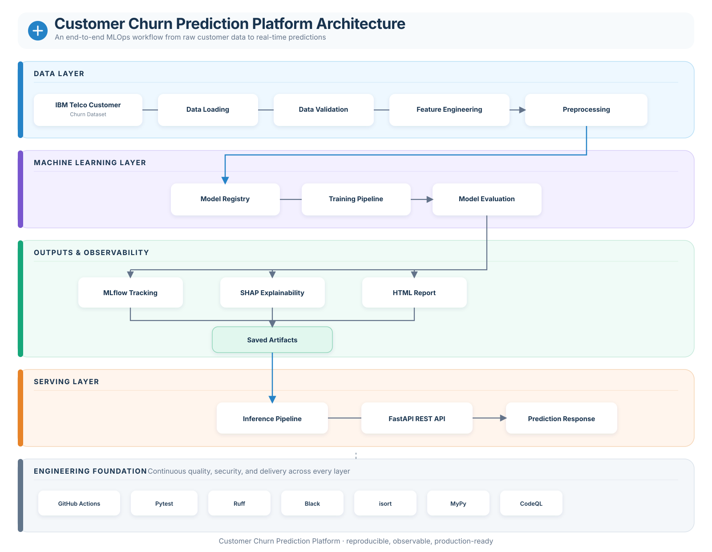

# 🚀 Customer Churn Prediction Platform

> A Machine Learning platform for predicting customer churn using modern ML engineering and MLOps best practices.

<p align="center">

[](https://github.com/dishant-0-0/Customer-Churn-Prediction-Platform/actions/workflows/codeql.yml)

[](https://github.com/dishant-0-0/Customer-Churn-Prediction-Platform/actions/workflows/ci.yml)


</p>

---

# 📌 Overview

Customer churn prediction is one of the most common business applications of Machine Learning. This project provides a **end-to-end ML platform** that predicts whether a customer is likely to churn while demonstrating modern software engineering, MLOps, testing, and deployment practices.

Unlike a traditional notebook-based ML project, this repository includes:

- End-to-end ML pipelines
- Feature engineering
- Model training & evaluation
- Experiment tracking with MLflow
- Model explainability with SHAP
- FastAPI REST API
- Automated HTML reporting
- Artifact persistence
- Comprehensive automated testing
- Continuous Integration using GitHub Actions

---

# ✨ Features

## Machine Learning

- Data validation
- Feature engineering
- Preprocessing pipeline
- Model registry
- Model training
- Model evaluation
- Prediction pipeline
- SHAP explainability

---

## MLOps

- MLflow experiment tracking
- Artifact persistence
- Model versioning
- HTML evaluation reports
- Training pipeline
- Inference pipeline

---

## Backend

- FastAPI REST API
- Pydantic request/response models
- Exception handling
- Dependency injection
- Middleware support

---

## Engineering

- Docker-ready architecture
- Configuration-driven design
- Modular project structure
- Logging
- Type checking (MyPy)
- Ruff
- Black
- isort
- Pre-commit hooks

---

## Quality Assurance

- **101 automated tests**
- **94% code coverage**
- Unit testing
- Integration testing
- Pipeline testing
- API testing
- GitHub Actions CI

---

## 🏗 Architecture

<p align="center">
  
</p>

---

# 📂 Project Structure

```text
Customer-Churn-Prediction-Platform
│
├── artifacts/
├── config/
├── data/
│
├── notebooks/
│
├── src/
│   ├── api/
│   ├── config/
│   ├── core/
│   ├── data/
│   ├── features/
│   ├── models/
│   ├── persistence/
│   ├── pipelines/
│   ├── preprocessing/
│   ├── reporting/
│   ├── tracking/
│   ├── utils/
│   └── visualization/
│
├── tests/
│
├── .github/
│   └── workflows/
│
├── requirements.txt
├── pyproject.toml
└── README.md
```

---

# 🛠 Technology Stack

| Category | Technologies |
|-----------|--------------|
| Language | Python 3.13 |
| ML | Scikit-Learn, XGBoost |
| Explainability | SHAP |
| API | FastAPI |
| Experiment Tracking | MLflow |
| Data | Pandas, NumPy |
| Visualization | Matplotlib, Seaborn |
| Testing | Pytest |
| Code Quality | Ruff, Black, isort, MyPy |
| CI/CD | GitHub Actions |
| Packaging | pyproject.toml |

---

# 📊 Dataset

Dataset: **IBM Telco Customer Churn**

Target Variable:

- Churn

Example features:

- Contract Type
- Monthly Charges
- Total Charges
- Tenure
- Internet Service
- Payment Method
- Customer Services

---

# ⚙ Machine Learning Pipeline

```text
Load Dataset

↓

Validate Data

↓

Feature Engineering

↓

Preprocessing

↓

Train Model

↓

Evaluate Model

↓

Generate SHAP Explanations

↓

Generate HTML Report

↓

Save Artifacts

↓

Log Experiment to MLflow
```

---

# 🚀 REST API

The project exposes a FastAPI application for real-time inference.

Example request:

```http
POST /predict
```

Example response:

```json
{
  "prediction": 1,
  "probability": 0.91
}
```

Interactive API documentation:

```text
http://localhost:8000/docs
```

---

# 📈 Experiment Tracking

Experiments are automatically logged using **MLflow**, including:

- Parameters
- Metrics
- Models
- Artifacts
- Figures

---

# 🔍 Model Explainability

The project includes SHAP-based explainability:

- Feature Importance
- SHAP Summary Plot
- Global Feature Impact

---

# 📄 HTML Reporting

Automatically generated reports include:

- Dataset summary
- Model metrics
- Confusion Matrix
- ROC Curve
- Precision-Recall Curve
- SHAP Visualizations

---

# 🧪 Testing

Current testing statistics:

| Metric | Value |
|---------|------:|
| Tests | **101** |
| Coverage | **94%** |

Run all tests:

```bash
pytest tests
```

Run with coverage:

```bash
pytest tests --cov=src --cov-report=term-missing
```

---

# 🔧 Installation

Clone the repository:

```bash
git clone https://github.com/dishant-0-0/Customer-Churn-Prediction-Platform.git
```

Create a virtual environment:

```bash
python -m venv venv
```

Activate it:

Windows:

```bash
venv\Scripts\activate
```

Linux / macOS:

```bash
source venv/bin/activate
```

Install dependencies:

```bash
pip install -r requirements.txt
pip install -e .
```

---

# ▶ Running the Project

Train the model:

```bash
python train.py
```

Start the API:

```bash
uvicorn src.api.app:app --reload
```

Open Swagger UI:

```text
http://localhost:8000/docs
```

---

# 🧹 Code Quality

Run Ruff:

```bash
ruff check .
```

Run Black:

```bash
black .
```

Run MyPy:

```bash
mypy src
```

Run pre-commit:

```bash
pre-commit run --all-files
```

---

# 🔄 Continuous Integration

GitHub Actions automatically performs:

- Dependency installation
- Ruff
- Black
- isort
- MyPy
- Pytest
- Coverage generation

Every push and pull request is automatically validated.

---

# 📌 Future Improvements

- Docker Compose
- Cloud deployment (Azure/AWS)
- Model monitoring
- Data drift detection
- Automated retraining
- Feature store integration
- Kubernetes deployment

---

# 📜 License

This project is licensed under the MIT License.

---

# 👨‍💻 Author

**Dishant Patel**

GitHub: https://github.com/dishant-0-0

---

## ⭐ If you found this project useful, consider giving it a star!
